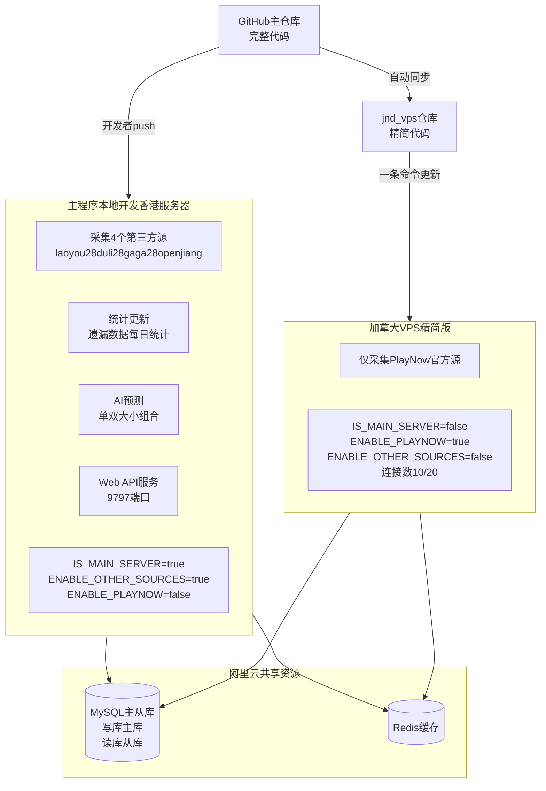
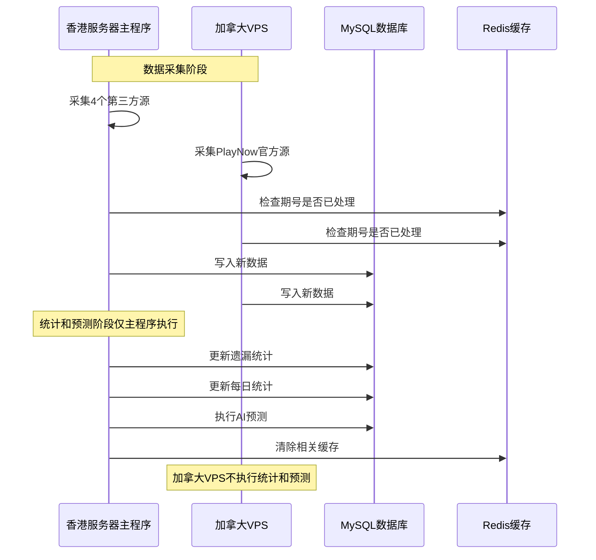

# 系统架构说明

> **重要提示：本文档是给AI助手和开发者的架构指南，请务必阅读理解！**

## 核心架构

本系统采用**双服务器架构**，但实际上是**一个主程序 + 一个精简采集器**的模式。

### 关键理解

**本地开发环境 = 香港服务器 = 主程序（完整功能）**
- 连接同一个阿里云数据库（主从库）
- 采集4个第三方数据源
- 执行统计更新和AI预测
- 提供Web API服务

**加拿大VPS = 精简采集器（单一职责）**
- 只负责采集PlayNow官方源（需要加拿大IP）
- 不执行任何统计更新
- 不执行AI预测
- 不提供Web API服务
- 使用最小数据库连接数

## 架构图



## 配置对比表

| 配置项 | 主程序（本地+香港） | 加拿大VPS |
|--------|---------------------|-----------|
| **服务器角色** | 主服务器 | 辅助采集器 |
| **IS_MAIN_SERVER** | `true` | `false` |
| **ENABLE_PLAYNOW** | `false` | `true` |
| **ENABLE_OTHER_SOURCES** | `true` | `false` |
| **WRITE_DB_CONNECTION_LIMIT** | 25 | 10 |
| **READ_DB_CONNECTION_LIMIT** | 50 | 20 |
| **数据采集** | 4个第三方源 | PlayNow官方源 |
| **统计更新** | ✅ 执行 | ❌ 不执行 |
| **AI预测** | ✅ 执行 | ❌ 不执行 |
| **Web API** | ✅ 提供 | ❌ 不提供 |
| **数据库** | 阿里云RDS | 阿里云RDS（同一个） |
| **Redis** | 阿里云Redis | 阿里云Redis（同一个） |

## 环境说明

### 1. 本地开发环境（Windows）

**用途：** 日常开发和调试

**配置文件：** `.env`（从 `.env.local.example` 复制）

**特点：**
- 与香港服务器功能完全相同
- 降低数据库连接数（2写/5读）避免占满连接池
- 开发模式日志（LOG_LEVEL=debug）
- 可以测试所有功能（除了PlayNow官方源，需要加拿大IP）

**启动命令：**
```bash
npm run dev
```

### 2. 香港服务器（生产环境）

**用途：** 主要生产服务器

**配置文件：** `.env`（手动配置或从模板复制）

**特点：**
- 完整功能运行
- 中等连接数（25写/50读）
- 生产模式日志（LOG_LEVEL=info）
- 提供Web API服务

**部署方式：** 宝塔面板或PM2

### 3. 加拿大VPS（辅助采集）

**用途：** 仅采集PlayNow官方数据源

**配置文件：** `deploy/env.canada`

**特点：**
- 精简功能，只采集数据
- 最小连接数（10写/20读）
- 不执行统计和预测
- 不提供Web API

**更新命令：** 见 [deploy/UPDATE_CANADA_VPS.md](deploy/UPDATE_CANADA_VPS.md)

## 数据流向



## 常见误区和问题

### ❌ 错误理解

1. **"本地开发需要连接本地数据库"**
   - 错误！本地开发连接的是阿里云生产数据库，与香港服务器相同

2. **"本地调试有问题，需要更新加拿大VPS"**
   - 错误！本地调试问题与加拿大VPS无关，应该检查本地配置

3. **"加拿大VPS需要完整代码"**
   - 错误！加拿大VPS只需要核心采集功能，不需要AI预测、Web前端等

### ✅ 正确理解

1. **本地开发 = 香港服务器**
   - 功能完全相同，只是连接数配置不同

2. **加拿大VPS是独立的采集器**
   - 只负责采集PlayNow官方源
   - 通过环境变量控制功能开关

3. **所有环境共享同一个数据库和Redis**
   - 通过Redis分布式锁避免重复处理
   - 通过IS_MAIN_SERVER控制统计更新

## 给AI助手的明确指引

**当用户说"本地调试"、"本地运行"、"开发环境"时：**
- ✅ 检查 `.env` 配置
- ✅ 检查数据库连接数配置
- ✅ 检查环境变量是否正确
- ❌ 不要提"更新加拿大VPS"
- ❌ 不要提"SSH到加拿大服务器"

**当用户说"加拿大VPS"、"PlayNow采集"时：**
- ✅ 提供加拿大VPS更新命令
- ✅ 检查 `deploy/env.canada` 配置
- ✅ 提醒只需要采集功能
- ❌ 不要提AI预测相关内容
- ❌ 不要提Web API相关内容

**当用户说"数据库连接数过多"时：**
- ✅ 检查 `.env` 中的连接数配置
- ✅ 建议使用 `.env.local.example` 的配置
- ✅ 检查是否有多个进程在运行
- ❌ 不要直接让用户修改数据库用户权限

## 工作流程

### 日常开发流程

```bash
# 1. 本地开发
npm run dev

# 2. 测试通过后提交
git add .
git commit -m "描述"
git push origin main

# 3. 香港服务器更新
# 在宝塔面板或SSH执行
git pull
npm install
npm run build
# 重启服务

# 4. 如果修改了数据采集逻辑，同步到加拿大VPS
bash scripts/sync-to-vps-repo.sh

# 5. 加拿大VPS更新（一条命令）
ssh root@155.138.135.124
cd ~/lottery-api && git pull && npm install && npm run build && pm2 restart lottery-api && pm2 logs --lines 30
```

### 什么时候需要更新加拿大VPS？

**需要更新：**
- ✅ 修改了数据采集逻辑（`src/modules/fetcher/`）
- ✅ 修改了数据写入逻辑（`src/modules/lottery/writer.ts`）
- ✅ 修改了数据库schema（`prisma/schema.prisma`）
- ✅ 修复了核心bug
- ✅ 更新了依赖包（`package.json`）

**不需要更新：**
- ❌ 修改了AI预测逻辑
- ❌ 修改了Web前端
- ❌ 修改了API路由
- ❌ 修改了统计更新逻辑
- ❌ 修改了Excel导出功能

## 故障排查

### 本地开发问题

**问题：数据库连接数过多**
```
ERROR 42000 (1203): User new_api already has more than 'max_user_connections' active connections
```

**解决方案：**
1. 检查 `.env` 中的连接数配置
2. 确保使用 `.env.local.example` 中的配置（2写/5读）
3. 停止所有Node进程：`taskkill /F /IM node.exe`
4. 等待30秒让连接释放
5. 重新启动：`npm run dev`

**问题：无法采集PlayNow数据**

**原因：** PlayNow官方源需要加拿大IP

**解决方案：** 本地无法测试PlayNow数据源，只能在加拿大VPS测试

### 加拿大VPS问题

**问题：VPS显示"更新统计"日志**

**原因：** `IS_MAIN_SERVER` 没有正确设置为 `false`

**解决方案：**
```bash
cd ~/lottery-api
cat .env | grep IS_MAIN_SERVER
# 应该显示：IS_MAIN_SERVER=false
# 如果不对，重新复制配置
cp deploy/env.canada .env
pm2 restart lottery-api
```

## 相关文档

- [本地开发指南](LOCAL_DEVELOPMENT.md) - 本地调试必看
- [加拿大VPS更新](deploy/UPDATE_CANADA_VPS.md) - 一条命令更新VPS
- [环境变量配置说明](deploy/ENV_CONFIG.md) - 详细的环境变量说明
- [VPS排除列表](deploy/VPS_EXCLUDE_LIST.md) - 加拿大VPS不需要的模块

## 技术栈

- **语言：** TypeScript
- **运行时：** Node.js 20
- **数据库：** MySQL 8.0（阿里云RDS）
- **缓存：** Redis 6.0（阿里云Redis）
- **ORM：** Prisma
- **Web框架：** Express
- **进程管理：** PM2
- **AI：** DeepSeek API

## 联系和支持

如有问题，请查看相关文档或检查日志：
```bash
# 本地开发
查看控制台输出

# 香港服务器
宝塔面板查看日志

# 加拿大VPS
pm2 logs lottery-api --lines 100
```


